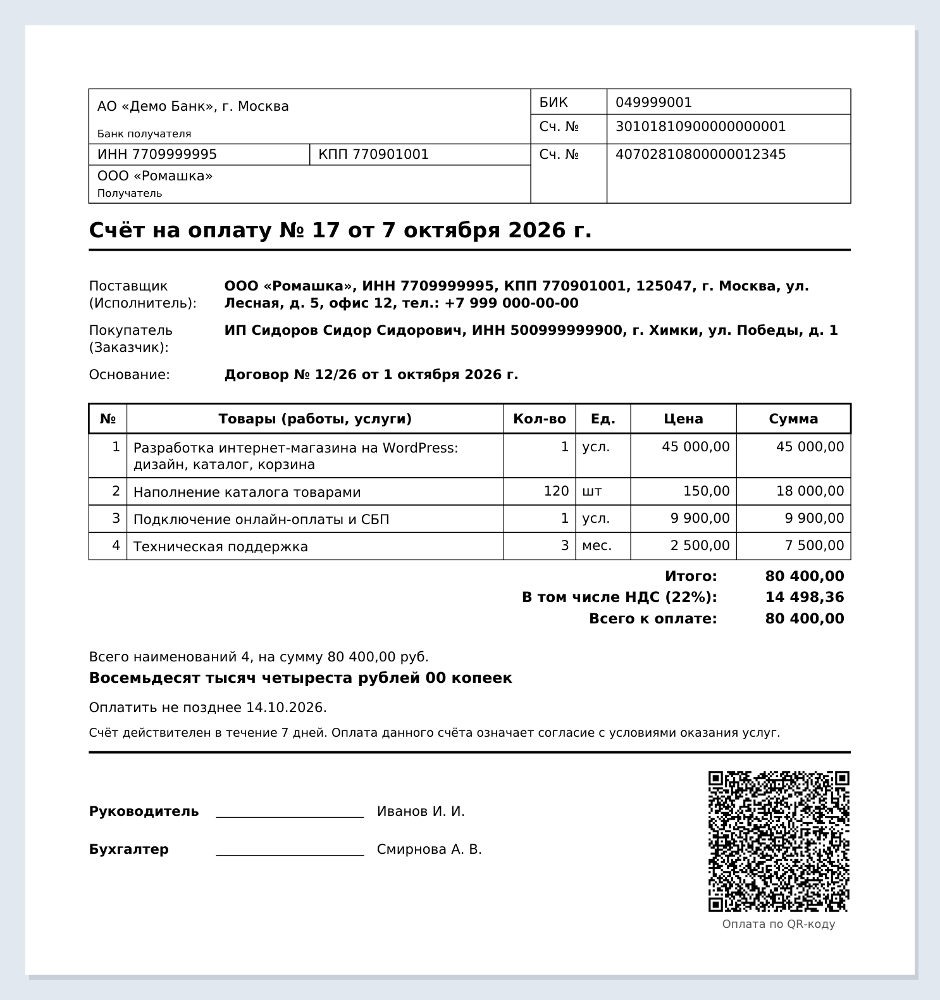
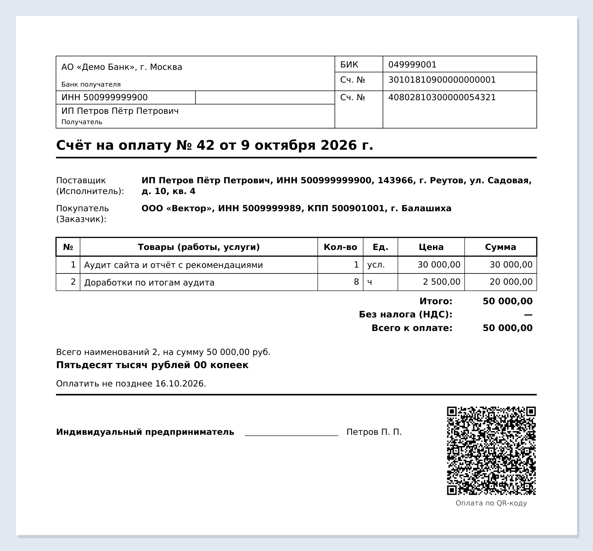
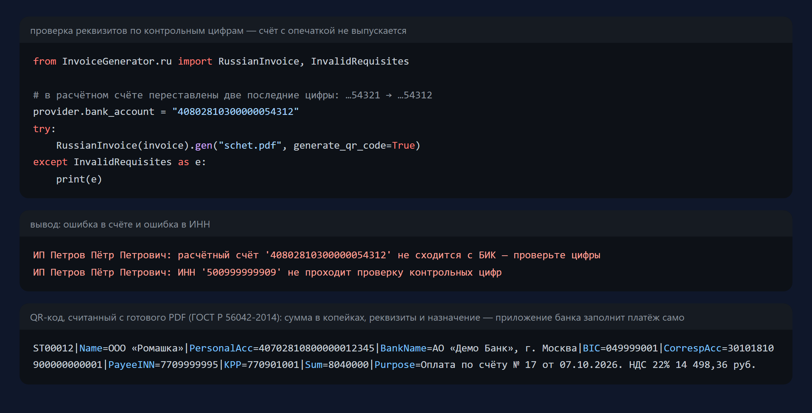

===================================================
InvoiceGenerator + российский «Счёт на оплату»
===================================================

Форк `by-cx/InvoiceGenerator <https://github.com/by-cx/InvoiceGenerator>`_ (184★) — библиотеки
для PDF-счетов на ReportLab. Оригинал умеет европейские и чешские счета. В форке добавлен
**российский счёт на оплату** в привычном виде, как из 1С, с проверкой реквизитов и
QR-кодом для оплаты из приложения банка.

Что добавлено
=============

- **Форма «Счёт на оплату»**: блок банковских реквизитов получателя (банк, БИК, корр. счёт,
  ИНН, КПП, расчётный счёт), поставщик и покупатель, основание (договор), таблица работ и
  услуг с переносом длинных названий, перенос на следующую страницу при большом числе
  позиций, подписи. У ИП вместо «Руководитель/Бухгалтер» — «Индивидуальный предприниматель».
- **НДС как принято в России**: цены уже с налогом («В том числе НДС»), начисление сверху
  или «Без налога (НДС)» для УСН и самозанятых. Разные ставки (22%, 10% и т. д.)
  суммируются по отдельности.
- **Сумма прописью** с правильными падежами: «Две тысячи один рубль 02 копейки».
- **QR-код для оплаты по ГОСТ Р 56042-2014**, тот, что понимают приложения российских банков:
  реквизиты, сумма в копейках и назначение платежа с суммой НДС. Код проверен
  распознаванием с готового PDF.
- **Проверка реквизитов по контрольным цифрам** до выпуска счёта: ИНН (10 и 12 цифр), КПП,
  БИК, расчётный и корреспондентский счёт в связке с БИК. Опечатка в одной цифре или почти
  любая перестановка соседних цифр — счёт не создаётся, а в ошибке сказано, что не так.
  Проверку можно отключить.
- Поля ``inn``, ``kpp``, ``bik``, ``corr_account`` у ``Provider``/``Client``. Старый код
  продолжает работать без изменений.

Пример
------

.. code-block:: python

    import datetime
    from InvoiceGenerator.api import Client, Creator, Invoice, Item, Provider
    from InvoiceGenerator.ru import RussianInvoice

    provider = Provider("ООО «Ромашка»", city="г. Москва", address="ул. Лесная, д. 5",
                        inn="7709999995", kpp="770901001", bank_name="АО «Демо Банк»",
                        bik="049999001", bank_account="40702810800000012345",
                        corr_account="30101810900000000001")
    invoice = Invoice(Client("ИП Сидоров С. С.", inn="500999999900"), provider, Creator("Иванов И. И."))
    invoice.number, invoice.date = 17, datetime.date(2026, 10, 7)
    invoice.add_item(Item(1, 45000, "Разработка сайта", unit="усл.", tax=22))
    RussianInvoice(invoice).gen("schet.pdf", generate_qr_code=True)

Полный пример — ``examples/russian_invoice.py``. Реквизиты в примерах выдуманные,
но корректные по контрольным цифрам (банка с БИК 049999001 не существует).

Также исправлено
----------------

- тест ``test_generator.py::test_gen`` падал на Windows (``NamedTemporaryFile`` нельзя
  открыть повторно), теперь пишет во временную папку;
- CI запускал ``python setup.py test``, а эту команду убрали из актуального setuptools.
  Теперь там pytest, Python 3.9–3.13.

Тесты: ``python -m pytest`` — 32 новых теста (сумма прописью, контрольные цифры на
настоящих публичных реквизитах, НДС, QR, содержимое PDF, многостраничный счёт) и 42 теста
оригинала, всего 74.

Лицензия BSD, как у оригинала. Автор оригинала — Adam Strauch (`by-cx <https://github.com/by-cx>`_).

----

================
InvoiceGenerator
================
.. image:: https://travis-ci.org/by-cx/InvoiceGenerator.svg?branch=master
    :target: https://travis-ci.org/by-cx/InvoiceGenerator
    
.. image:: https://img.shields.io/pypi/v/InvoiceGenerator.svg
  :target: https://pypi.python.org/pypi/InvoiceGenerator/
  :alt: Latest Version

This is library to generate a simple invoices.
Currently supported formats are PDF and XML for Pohoda accounting system.
PDF invoice is based on ReportLab.

.. image:: https://raw.githubusercontent.com/mezka/InvoiceGenerator/master/example_with_vat.png
   :alt: Example image of invoice
   :width: 25%

Installation
============

Run this command as root::

	pip install InvoiceGenerator

If you want upgrade to new version, add ``--upgrade`` flag::

	pip install InvoiceGenerator --upgrade

You can use setup.py from GitHub repository too::

	python setup.py install

Documentation
-------------

Complete documentation is available on
`Read The Docs <http://readthedocs.org/docs/InvoiceGenerator/>`_.

Example
=======

Basic API
---------

Define invoice data first::

	import os

	from tempfile import NamedTemporaryFile

	from InvoiceGenerator.api import Invoice, Item, Client, Provider, Creator

	# choose english as language
	os.environ["INVOICE_LANG"] = "en"

	client = Client('Client company')
	provider = Provider('My company', bank_account='2600420569', bank_code='2010')
	creator = Creator('John Doe')

	invoice = Invoice(client, provider, creator)
	invoice.currency_locale = 'en_US.UTF-8'
	invoice.add_item(Item(32, 600, description="Item 1"))
	invoice.add_item(Item(60, 50, description="Item 2", tax=21))
	invoice.add_item(Item(50, 60, description="Item 3", tax=0))
	invoice.add_item(Item(5, 600, description="Item 4", tax=15))

Note: Due to Python's representational error, write numbers as integer ``tax=10``,
Decimal ``tax=Decimal('10.1')`` or string ``tax='1.2'`` to avoid getting results with
lot of decimal places.

PDF
---

Generate PDF invoice file::

	from InvoiceGenerator.pdf import SimpleInvoice

	pdf = SimpleInvoice(invoice)
	pdf.gen("invoice.pdf", generate_qr_code=True)

Pohoda XML
----------

Generate XML invoice file::

	from InvoiceGenerator.pohoda import SimpleInvoice

	pdf = SimpleInvoice(invoice)
	pdf.gen("invoice.xml")

Note: Pohoda uses three tax rates: none: 0%, low: 15%, high: 21%.
If any item doesn't meet those percentage, the rateVat parameter will
not be set for those items resulting in 0% tax rate.

Only SimpleInvoice is currently supported for Pohoda XML format.

Hacking
=======

Fork the `repository on github <https://github.com/creckx/InvoiceGenerator>`_ and
write code. Make sure to add tests covering your code under `/tests/`. You can
run tests using::

    python setup.py test

Then propose your patch via a pull request.

Documentation is generated from `doc/source/` using `Sphinx
<http://sphinx-doc.org/>`_::

    python setup.py build_sphinx

Then head to `doc/build/html/index.html`.
